```{r, include=FALSE}
library(tidyverse)
library(knitr)
library(emo)
library(data.table)
```

```{r xaringan-panelset, echo=FALSE}
xaringanExtra::use_panelset()
```

class: center, middle

```{r qrcode, echo=FALSE, out.width='30%'}

```
</div>
.center[
[guilhermefco.github.io/Sia2022](guilhermefco.github.io/Sia2022)
]

---
## Orientação

.center[
Professor Doutor Guaraci Requena de Lima
]

## Apoio

.center[
```{r cnpq, echo=FALSE, out.width='50%'}

```
]

---
# Sumário

- O que é Machine Learning?
- Tipos de Modelo
- Random Forest
- Processamento de Linguagem Natural
- Term frequency–inverse document frequency
- Aplicação a uma base real
- Próximos passos
- Onde queremos chegar

---
# O que é Machine Learning?

```{r ia, echo=FALSE, out.width='80%', fig.align='center'}
knitr::include_graphics('img/machinelearning.gif')
```

**Fonte:** [TUMBLR](https://24.media.tumblr.com/tumblr_mb7vwlkm1a1rhb8umo1_500.gif)

---
# O que é Machine Learning?

.justify[
"Machine learning é um ramo da inteligência artificial (IA) e da ciência da computação que se concentra no uso de dados e algoritmos para imitar a maneira como os humanos aprendem, melhorando gradualmente sua precisão."
]

**Fonte:** [IBM](https://www.ibm.com/br-pt/cloud/learn/machine-learning)
--
</br></br>
.justify[
"Por meio do uso de métodos estatísticos, os algoritmos são treinados para fazer classificações ou previsões, revelando os principais insights em projetos"
]

**Fonte:** [IBM](https://www.ibm.com/br-pt/cloud/learn/machine-learning)
---

# Dominação Mundial

```{r terminator, echo=FALSE, out.width='80%', fig.align='center'}
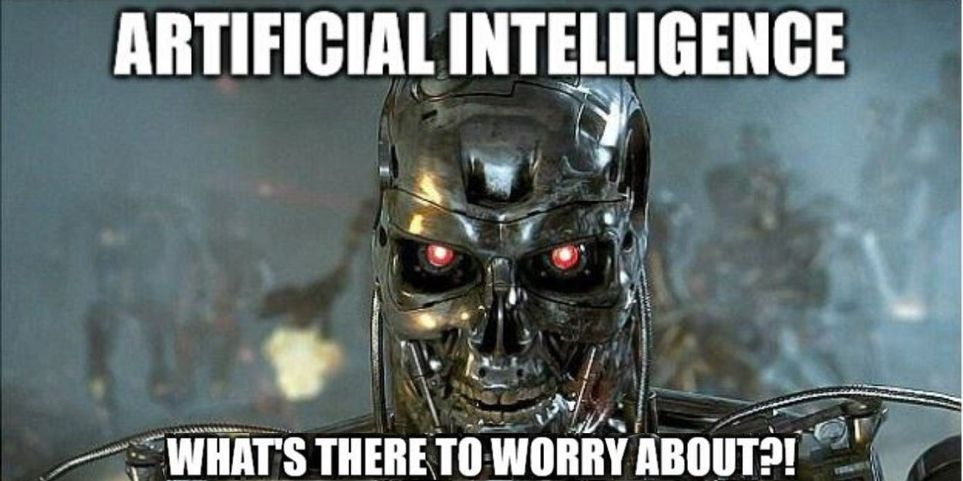
```

**Fonte:** [SCREEN RANT](https://screenrant.com/terminator-logic-memes-funny/)

---
# Tipos de Modelos

.panelset[
  .panel[.panel-name[Modelo Supervisionado]
.center[
```{r supervisionado, echo=FALSE, out.width='60%'}
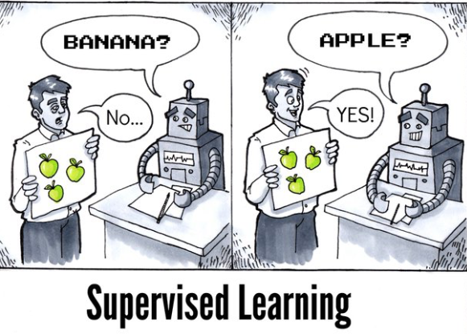
```
]

**Fonte:** [progamaria](https://www.programaria.org/carreira-em-machine-learning-como-se-preparar-para-trabalhar-na-area/)
  ]
  .panel[.panel-name[Modelo Não Supervisionado]
.center[
```{r naosupervisionado, echo=FALSE, out.width='60%'}
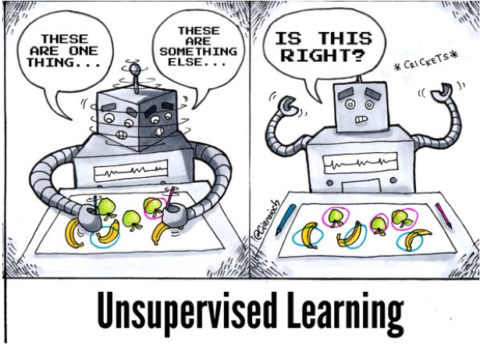
```
]

**Fonte:** [progamaria](https://www.programaria.org/carreira-em-machine-learning-como-se-preparar-para-trabalhar-na-area/)
  ]
]

---
# Random Forest

---
# Random Forest

.justify[
Exemplo: Warley precisa comprar um celular novo, mas não sabe como decidir. Dessa forma, ele pega uma lista de celulares e quer resumir em poucos casos.
]

#### Arvóre de Decisão

--
.center[
```{r decisionTree, echo=FALSE, out.width='90%'}
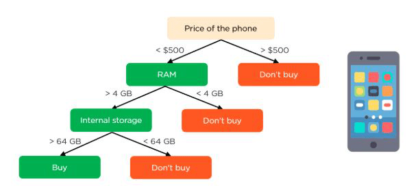
```
]

**Fonte:** [Section](https://www.section.io/engineering-education/introduction-to-random-forest-in-machine-learning/)

---
# Random Forest

.center[
```{r randomforest, echo=FALSE, out.width='75%'}
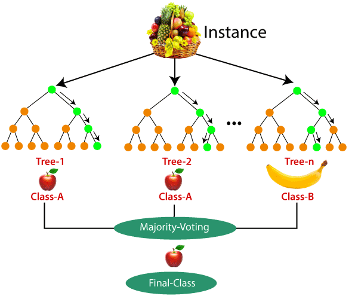
```
]

**Fonte:** [Section](https://www.section.io/engineering-education/introduction-to-random-forest-in-machine-learning/)
---
# Processamento de Linguagem Natural

.center[
```{r nlp, echo=FALSE, out.width='90%'}

```
]

**Fonte:** [LinkedIn](https://www.linkedin.com/pulse/processamento-de-linguagem-natural-qual-import%C3%A2ncia-da-vitorino/?originalSubdomain=pt)

---
# Processamento de Linguagem Natural

## Token
## Dicionário
## Corpus
## Pré-Processamento
- ### Stop Words
- ### Flexão

---
# Processamento de Linguagem Natural

## Flexão

### Stemming

"Stemming é uma abordagem baseada em regras que converte as palavras em sua palavra raiz (radical) para remover a flexão sem se preocupar com o contexto da palavra na frase."

### Lematização 

"A lematização, ao contrário de Stemming, reduz as palavras flexionadas adequadamente, garantindo que a palavra raiz (lema) pertence ao idioma."

**Fonte:** [INSIGHT](https://insightlab.ufc.br/pln-processamento-de-linguagem-natural-para-iniciantes)


---
# Processamento de Linguagem Natural

## Flexão

.center[
```{r lemmaVSsteming, echo=FALSE, out.width='100%'}
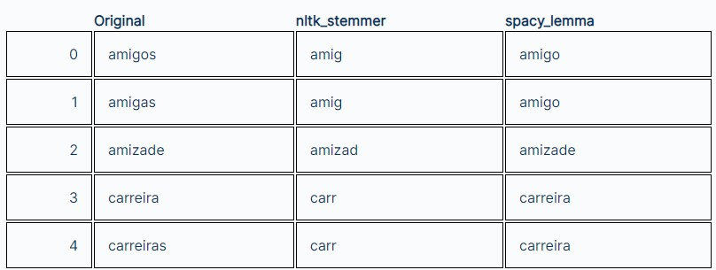
```
]

**Fonte:** [Alura](https://www.alura.com.br/artigos/lemmatization-vs-stemming-quando-usar-cada-uma)

---
# Term frequency–inverse document frequency

.panelset[
  .panel[.panel-name[TF]
.center[

$tf(t, d) = \dfrac{\text{Número de vezes que o token } t \text{ aparece no dicionário } d}{\text{Número total de tokens no dicionário }d}$
]

  ]

  .panel[.panel-name[IDF]
.center[
$IDF(t) = \ln{\bigg( \dfrac{\text{Número total de dicionários }}{\text{Número de dicionários que o token } t \text{ aparece} + 1} \bigg)}$

]

  ]

  .panel[.panel-name[TF-IDF]
.center[
$tf\text{-}IDF(t, d) = tf(t, d) \cdot IDF(t)$
]

  ]
]

---
# Aplicação a uma base real

.center[
```{r kaggle, echo=FALSE, out.width='100%'}
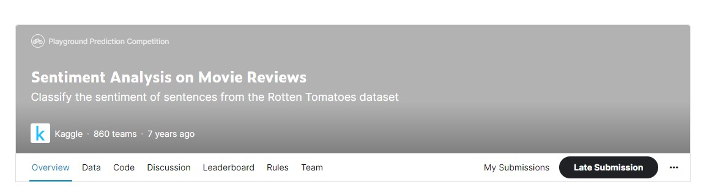
```
]

**Fonte:** [Link](https://www.kaggle.com/competitions/sentiment-analysis-on-movie-reviews)

--
- 0: Negativo
- 1: Um pouco negativo
- 2: Neutro
- 3: Um pouco positivo
- 4: Positivo

---
# Base

Linhas: 

.center[
```{r base, echo=FALSE, out.width='100%'}
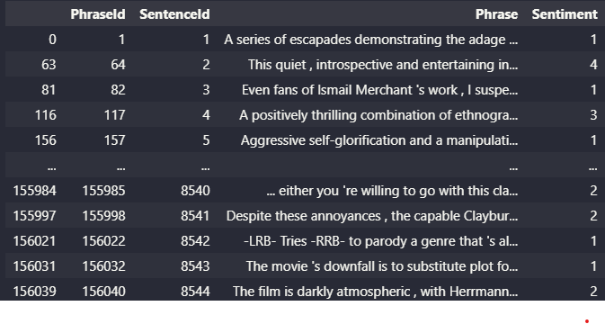
```
]

---
# Pós Pré-Processamento

Linhas: 8497

.center[
```{r basepos, echo=FALSE, out.width='100%'}
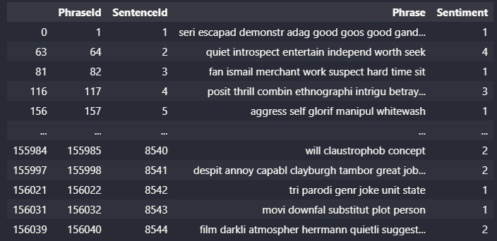
```
]

---
# Matrizes

Linhas: 8497

Colunas: 10142

.panelset[
  .panel[.panel-name[Apenas Frequência]
.center[
```{r tf, echo=FALSE, out.width='150%'}
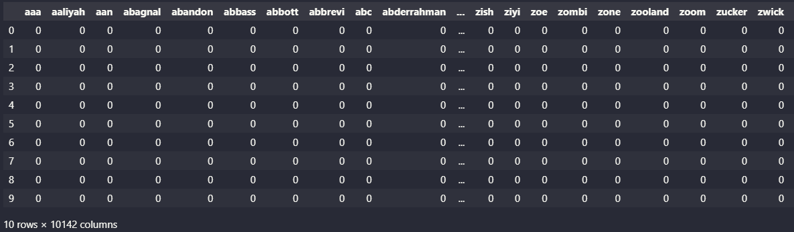
```
]

  ]
  .panel[.panel-name[TF-IDF]
.center[
```{r tfidf, echo=FALSE, out.width='150%'}
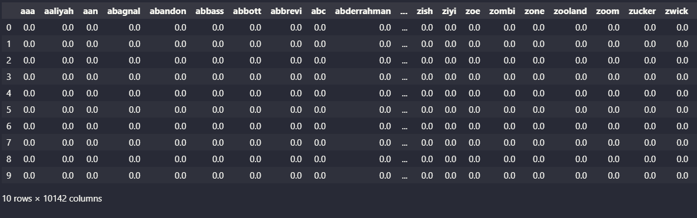
```
]

  ]
]

---
# Após SVD

Linhas: 8497

Colunas: 25

.panelset[
  .panel[.panel-name[Apenas Frequência]
.center[
```{r tfsvd, echo=FALSE, out.width='100%'}
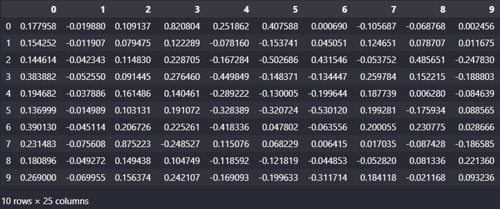
```
]

  ]
  .panel[.panel-name[TF-IDF]
.center[
```{r tfidfsvd, echo=FALSE, out.width='100%'}
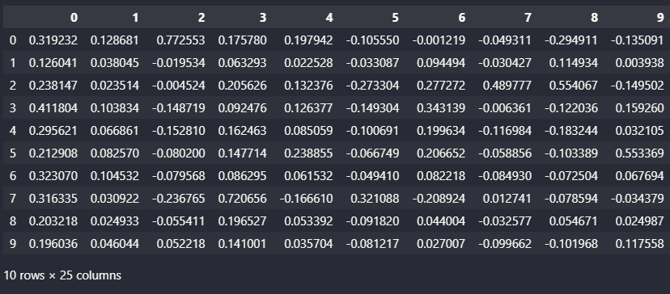
```
]

  ]
]


---
# Resultados

.panelset[
  .panel[.panel-name[Apenas Frequência]
.center[
```{r tfpredict, echo=FALSE, out.width='25%'}
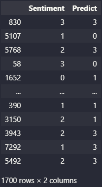
```
]

  ]
  .panel[.panel-name[TF-IDF]
.center[
```{r tfidfpredict, echo=FALSE, out.width='25%'}
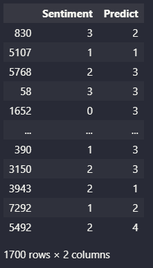
```
]

  ]
]
---
# Resultados

- ### Score Apenas Frequência: 0.249
- ### Score TF-IDF: 0.261
---
# Próximos passos

- ## Conseguir ajustar um modelo para esta base

--
- ## Aplicar em uma base real

--
- ## Escrever o relatório

---
# Onde queremos chegar

- ## Construir uma api

---
# Referências

- Practical Text Analytics, Murugan Anandarajan, Chelsey Hill, Thomas Nolan
- R
- Python
---
# Contato

.center[
Guilherme Fernandes Castro de Oliveira
]

```{r eu, echo=FALSE, out.width='35%', fig.align='center'}
knitr::include_graphics('img/eu.jpeg')
```

.center[
<a href="https://www.linkedin.com/in/guifernandesco/"><i class="fab fa-linkedin" style="font-size:40px;"></i></a>
<a href="https://github.com/GuilhermeFCO"><i class="fab fa-github" style="font-size:40px;"></i></a>
<a href="https://www.facebook.com/guifernandesco"><i class="fab fa-facebook" style="font-size:40px;"></i></a>
<a href="https://www.instagram.com/guifernandesco/"><i class="fab fa-instagram" style="font-size:40px;"></i></a>
<a href="https://twitter.com/guifernandesco"><i class="fab fa-twitter" style="font-size:40px;"></i></a>
<a href="mailto:guilherme.f.castro@ufv.br"><i class="far fa-envelope" style="font-size:40px;"></i></i></a>
]
.center[
**E-mail:** <a href="mailto:guilherme.f.castro@ufv.br">guilherme.f.castro@ufv.br</a>
]

---
class: center, middle, inverse

# Obrigado!
