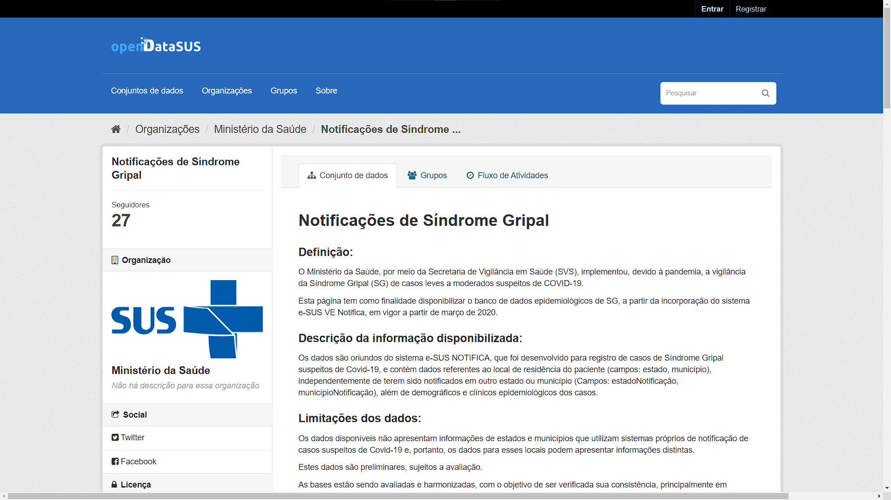
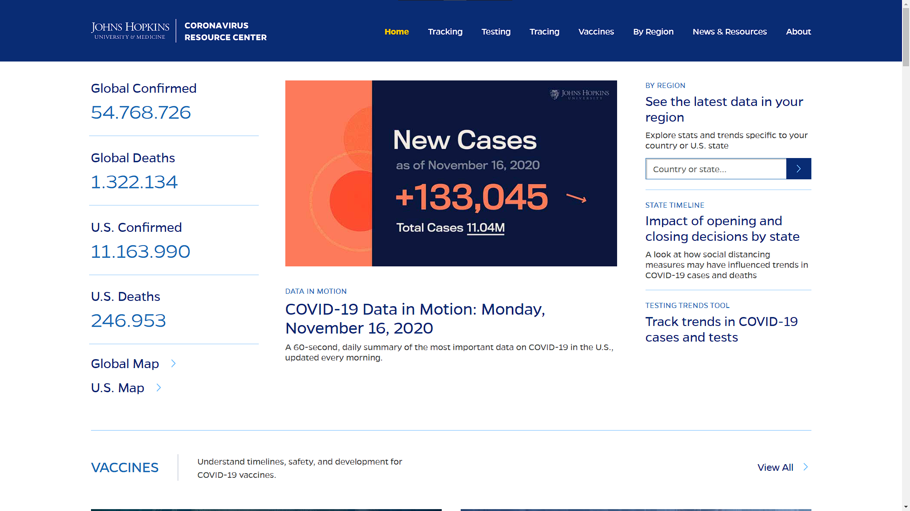

```{r, include=FALSE}
library(tidyverse)
library(knitr)
library(emo)
library(data.table)
```

```{r xaringan-panelset, echo=FALSE}
xaringanExtra::use_panelset()
```

class: center, middle

```{r qrcode, echo=FALSE, out.width='30%'}
knitr::include_graphics('img/Sia2022.png')
```
</div>
.center[
[guilhermefco.github.io/Sia2022](guilhermefco.github.io/Sia2022)
]

---
## Orientação

.center[
Professor Doutor Guaraci Requena de Lima
]

## Apoio

.center[
```{r cnpq, echo=FALSE, out.width='50%'}
knitr::include_graphics('img/pibic_cnpq.jpg')
```
]

---
# Sumário

- O que é Machine Learning?
- Tipos de Modelo
- Processamento de Linguagem Natural
- Term frequency–inverse document frequency
- Aplicação a uma base real
- Próximos passos
- Onde queremos chegar

---
# O que é Machine Learning?

.justify[
"Machine learning é um ramo da inteligência artificial (IA) e da ciência da computação que se concentra no uso de dados e algoritmos para imitar a maneira como os humanos aprendem, melhorando gradualmente sua precisão."
]

--

"Por meio do uso de métodos estatísticos, os algoritmos são treinados para fazer classificações ou previsões, revelando os principais insights em projetos"

**Fonte:** [IBM](https://www.ibm.com/br-pt/cloud/learn/machine-learning)

---
# Tipos de Modelos


---
# Processamento de Linguagem Natural


---
# Term frequency–inverse document frequency

.panelset[
  .panel[.panel-name[TF]
.center[
```{r govCovid, echo=FALSE, out.width='75%'}
# 
```
]

<!-- **Fonte:** [Governo Federal do Brasil](https://opendatasus.saude.gov.br/dataset/casos-nacionais) -->
  ]

  .panel[.panel-name[IDF]
.center[
```{r Brasil.io, echo=FALSE, out.width='75%'}
# 
```
]

<!-- **Fonte:** [Brasil.io](https://brasil.io/home/) -->
  ]

  .panel[.panel-name[TF-IDF]
.center[
```{r jhData, echo=FALSE, out.width='75%'}
# 
```
]

<!-- **Fonte:** [Jhon Hopkins University](https://github.com/CSSEGISandData/COVID-19) -->
  ]
]

---
# Aplicação a uma base real


---
# Próximos passos


---
# Onde queremos chegar


---
# Referências


---
# Contato

.center[
Guilherme Fernandes Castro de Oliveira
]
.center[
``` {r eu, echo=FALSE, out.width='35%'}
# knitr::include_graphics('img/eu.jpeg')
```
]
<!-- .center[ -->
<!-- <a href="https://www.linkedin.com/in/guifernandesco/"><i class="fa-brands fa-linkedin" style="font-size:40px;"></i></a> -->
<!-- <a href="https://github.com/GuilhermeFCO"><i class="fa-brands fa-github" style="font-size:40px;"></i></a> -->
<!-- <a href="https://www.facebook.com/guifernandesco"><i class="fa-brands fa-facebook" style="font-size:40px;"></i></a> -->
<!-- <a href="https://www.instagram.com/guifernandesco/"><i class="fa-brands fa-instagram" style="font-size:40px;"></i></a> -->
<!-- <a href="https://twitter.com/guifernandesco"><i class="fa-brands fa-twitter" style="font-size:40px;"></i></a> -->
<!-- <a href="mailto:guilherme.f.castro@ufv.br"><i class="far fa-envelope" style="font-size:40px;"></i></i></a> -->
<!-- ] -->
.center[
**E-mail:** <a href="mailto:guilherme.f.castro@ufv.br">guilherme.f.castro@ufv.br</a>
]

---
class: center, middle, inverse

# Obrigado!
